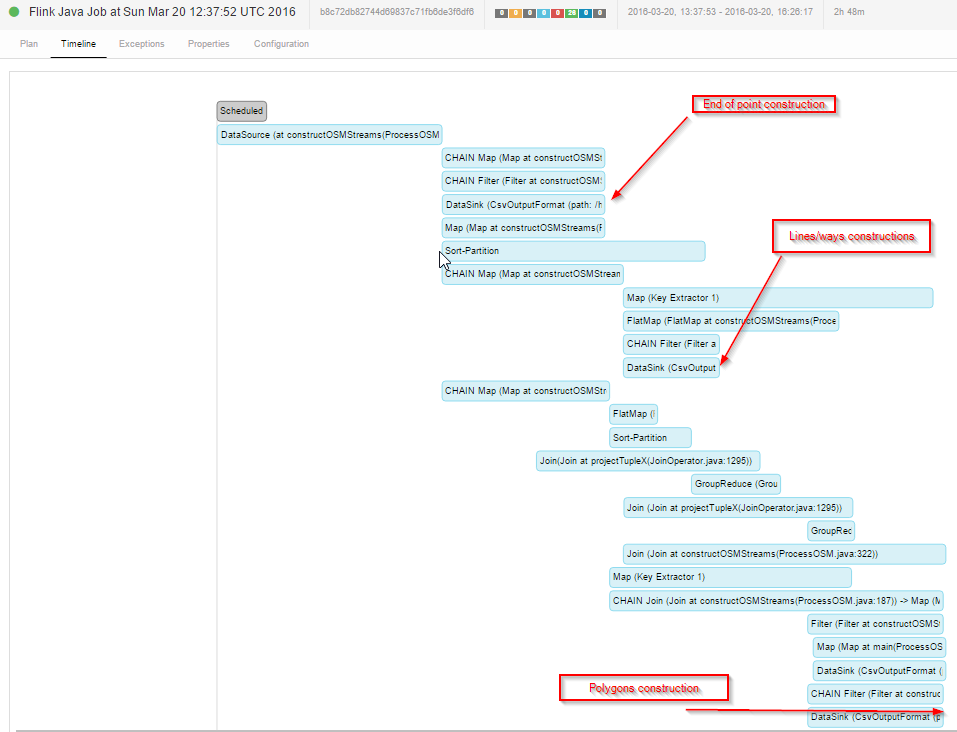

#Benchmark executing osm construct March 2016

benchmark executed on an ec2 instance m4.xlarge
500 gb of SSD (general purpose)

##Protocol

local execution (1 taskmanager), 4 CPU, 8gb reserved for taskmanager

##Timing

##During execution

##Output dataset

	>> du .

	18674536        ./ways.csv
	19388940        ./rels.csv
	1380764 ./polygons.csv
	1447944 ./nodes.csv
	40892188        .
