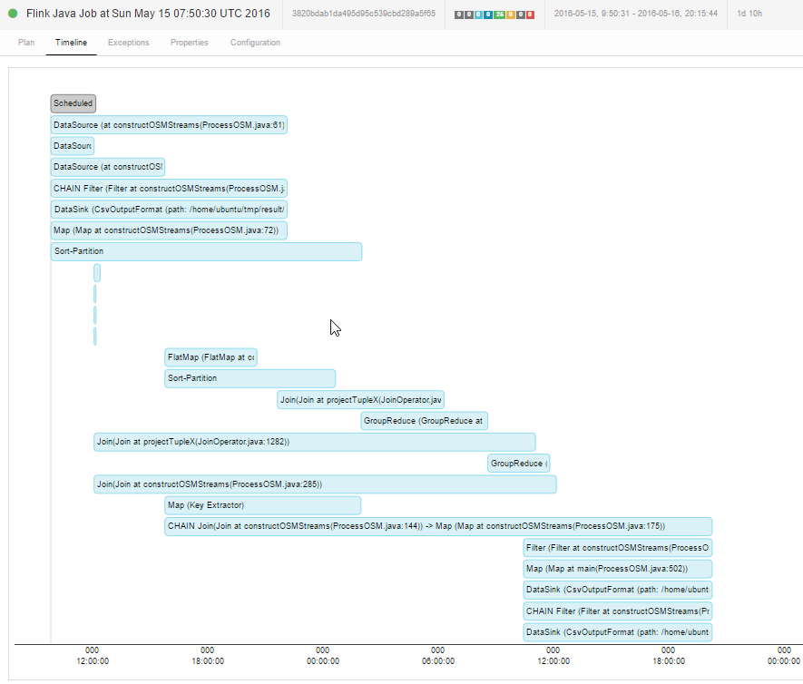
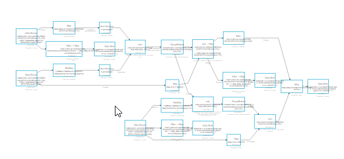

#Bench integration planet - flink 1.0.3 - M4.large machine on EC2 - AWS

Protocol :

	flink 1.0.3 - simple cluster
	AWS M4.large machine

input file :

	drwxrwxr-x 3 ubuntu ubuntu        4096 May 15 07:51 ./
	drwxr-xr-x 8 ubuntu ubuntu        4096 May 16 18:44 ../
	-rw-rw-r-- 1 ubuntu ubuntu 33824022380 May  5 06:54 planet-latest.osm.pbf
	drwxrwxr-x 6 ubuntu ubuntu        4096 May 16 08:26 result/

33go of PBF

outputs :

	ubuntu@ip-172-31-18-167:~/tmp/result$ du -m
	1137    ./rels.csv
	12193   ./nodes.csv
	14776   ./polygons.csv
	120719  ./ways.csv
	148824  .

148 go of CSV output files

final status of storage unit :

	ubuntu@ip-172-31-18-167:~/tmp/result$ date && df
	Mon May 16 21:39:55 UTC 2016
	Filesystem     1K-blocks      Used Available Use% Mounted on
	udev             4082864        12   4082852   1% /dev
	tmpfs             817564       344    817220   1% /run
	/dev/xvda1     722345872 203982564 488904544  30% /
	none                   4         0         4   0% /sys/fs/cgroup
	none                5120         0      5120   0% /run/lock
	none             4087816         0   4087816   0% /run/shm
	none              102400         0    102400   0% /run/user

#Results

1d and 10h - 34h

explain plan :

##Execution feedback

at launch :
	
	ubuntu@ip-172-31-18-167:~/tmp$ iostat
	Linux 3.13.0-74-generic (ip-172-31-18-167)      05/15/2016      _x86_64_        (2 CPU)
	
	avg-cpu:  %user   %nice %system %iowait  %steal   %idle
	           4.14    0.04    0.80   13.08    4.59   77.36
	
	Device:            tps    kB_read/s    kB_wrtn/s    kB_read    kB_wrtn
	xvda            120.18       270.63     13049.71     787445   37970212

during execution :

(end of input file reading) :

	04:30:01 PM     CPU     %user     %nice   %system   %iowait    %steal     %idle
	04:32:02 PM     all     98.39      0.00      1.40      0.03      0.00      0.18
	04:34:01 PM     all     98.42      0.00      1.40      0.02      0.00      0.16
	04:36:01 PM     all     98.36      0.00      1.39      0.07      0.00      0.18
	04:38:01 PM     all     98.47      0.00      1.33      0.03      0.00      0.17
	04:40:01 PM     all     98.23      0.00      1.28      0.31      0.00      0.18
	04:42:04 PM     all     98.34      0.00      1.44      0.02      0.00      0.21
	04:44:01 PM     all     98.41      0.00      1.36      0.03      0.00      0.20
	04:46:01 PM     all     98.51      0.00      1.29      0.04      0.00      0.16
	04:48:01 PM     all     98.49      0.00      1.35      0.03      0.00      0.14

join phase :

	ubuntu@ip-172-31-18-167:~$ iostat
	Linux 3.13.0-74-generic (ip-172-31-18-167)      05/16/2016      _x86_64_        (2 CPU)
	
	avg-cpu:  %user   %nice %system %iowait  %steal   %idle
	          78.88    0.03    2.11   11.47    0.16    7.34
	
	Device:            tps    kB_read/s    kB_wrtn/s    kB_read    kB_wrtn
	xvda            268.28     14682.89     17990.57 1297285337 1589530344

disk usage :

	ubuntu@ip-172-31-18-167:~$ date
	Mon May 16 08:01:05 UTC 2016
	ubuntu@ip-172-31-18-167:~$ df
	Filesystem     1K-blocks      Used Available Use% Mounted on
	udev             4082864        12   4082852   1% /dev
	tmpfs             817564       344    817220   1% /run
	/dev/xvda1     722345872 522927736 169959372  76% /
	none                   4         0         4   0% /sys/fs/cgroup
	none                5120         0      5120   0% /run/lock
	none             4087816         0   4087816   0% /run/shm
	none              102400         0    102400   0% /run/user

	ubuntu@ip-172-31-18-167:~/tmp/result$ date
	Mon May 16 13:16:29 UTC 2016
	ubuntu@ip-172-31-18-167:~/tmp/result$ df
	Filesystem     1K-blocks      Used Available Use% Mounted on
	udev             4082864        12   4082852   1% /dev
	tmpfs             817564       344    817220   1% /run
	/dev/xvda1     722345872 305616232 387270876  45% /
	none                   4         0         4   0% /sys/fs/cgroup
	none                5120         0      5120   0% /run/lock
	none             4087816         0   4087816   0% /run/shm
	none              102400         0    102400   0% /run/user

process usage during integration :

	ubuntu@ip-172-31-18-167:~$ date
	Mon May 16 13:27:22 UTC 2016
	ubuntu@ip-172-31-18-167:~$ sar | tail
	01:10:02 PM     all     82.03      0.00      1.96     10.36      0.00      5.65
	01:12:01 PM     all     81.05      0.00      1.87     10.92      0.01      6.16
	01:14:01 PM     all     83.74      0.00      1.75      9.37      0.00      5.12
	01:16:01 PM     all     81.89      0.00      1.91      9.79      0.00      6.40
	01:18:01 PM     all     78.93      0.00      2.00     12.00      0.01      7.06
	01:20:01 PM     all     83.04      0.00      1.98      9.58      0.00      5.39
	01:22:01 PM     all     81.11      0.00      1.76      9.83      0.00      7.30
	01:24:01 PM     all     82.64      0.00      1.99      9.74      0.01      5.62
	01:26:02 PM     all     80.07      0.00      1.98     11.90      0.00      6.05
	Average:        all     59.08      0.05      2.37     26.95      0.02     11.52

during integration :

	ubuntu@ip-172-31-18-167:~$ date && df
	Mon May 16 17:20:28 UTC 2016
	Filesystem     1K-blocks      Used Available Use% Mounted on
	udev             4082864        12   4082852   1% /dev
	tmpfs             817564       344    817220   1% /run
	/dev/xvda1     722345872 223740720 469146388  33% /
	none                   4         0         4   0% /sys/fs/cgroup
	none                5120         0      5120   0% /run/lock
	none             4087816         0   4087816   0% /run/shm
	none              102400         0    102400   0% /run/user

	ubuntu@ip-172-31-18-167:~$ date && sar | tail
	Mon May 16 17:21:23 UTC 2016
	05:04:01 PM     all     86.55      0.00      1.54      7.69      0.01      4.21
	05:06:01 PM     all     88.05      0.00      1.51      6.63      0.01      3.80
	05:08:01 PM     all     85.56      0.00      1.56      7.86      0.01      5.01
	05:10:01 PM     all     88.14      0.00      1.48      6.31      0.01      4.06
	05:12:01 PM     all     86.31      0.00      1.43      7.76      0.01      4.50
	05:14:01 PM     all     85.04      0.00      1.45      8.61      0.01      4.89
	05:16:01 PM     all     80.57      0.00      1.38      6.69      0.01     11.36
	05:18:02 PM     all     62.79      0.00      1.08      7.20      0.03     28.90
	05:20:01 PM     all     62.23      0.00      1.08      7.16      0.03     29.50
	Average:        all     65.00      0.04      2.19     22.63      0.02     10.11

at the end of process :

