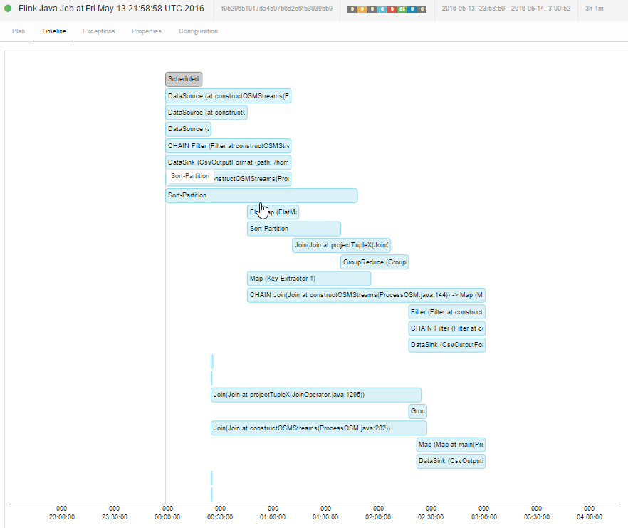

#Benchmark executing osm construct May 14th 2016 

France integration, using FLINK 0.10.2 - and the updated process of integration, 

 
	initial PBF size : 3.2G May 10 04:24 france-latest.osm.pbf

Generated CSV Folder Size : 21g

	190     ./rels.csv
	1274    ./nodes.csv
	1414    ./polygons.csv
	18383   ./ways.csv
	21260   .

##Protocol

local cluster execution (1 taskmanager), 2 CPU, 8gb TOTAL RAM, 4Gb used

##Timing - configuration

3 hours on a EC2, t2.large instance, 2 CPU, 400 go magnetic storage unit.

